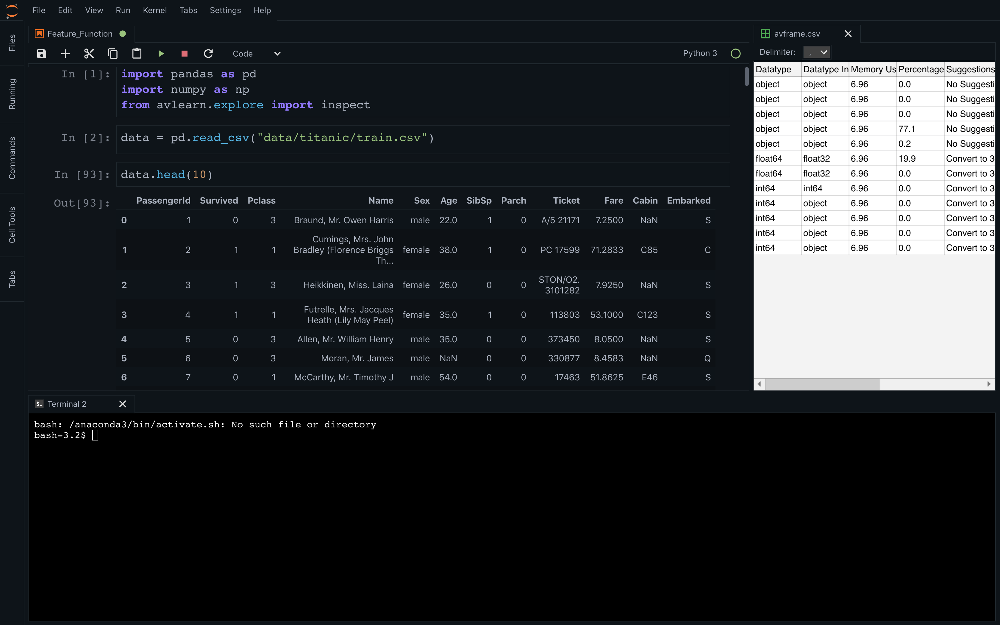

# Jupyterlab-theme 

by Mohammad Shahebaz

The following theme modifies the default jupyter lab theme. Here are few screenshots - 

## Setup Instructions

1. Download Stylish Chrome Extension from [here](https://chrome.google.com/webstore/detail/stylish-custom-themes-for/fjnbnpbmkenffdnngjfgmeleoegfcffe?hl=en)
2. Install / Add to your Google Chrome. 
3. Visit https://goo.gl/PPmH92 and install the theme. 
4. Enjoy
